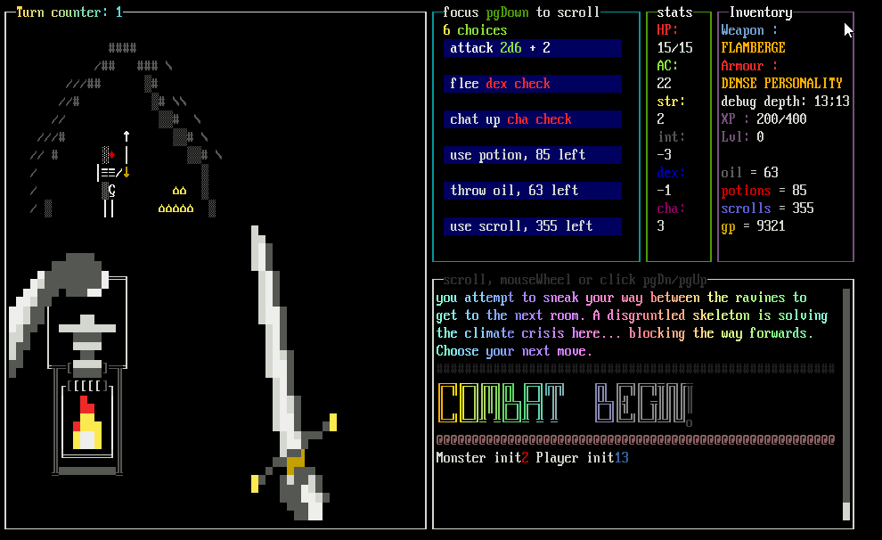

# js node project
terminal ui based game (Incomplete)
using this as an excuse to learn js and figure out how to deal with game logic.
Any kind of rpg/rougelite game logic is deceptively complex, and that is where my game dev interest leans towards.

## terminals tested

#### tabby for linux
#### konsole for linux
#### windows terminal(IT'S NOT POWERSHELL OR CMD) with WSL 
#### CMD with WSL 
#### powershell with WSL
\
\
\
 
## how to run
Use WSL2(windows subsystem for linux), windows default terminal mode is incompatible.\
Use a Linux terminal with xterm-256colors as term info.
 

TERMINAL COLUMNS AND ROWS SHOULD BE SET TO <b>120 columns 30 rows</b>
 

it works on WSL and is reccomended to be ran on windows terminal as it's super easy to change fonts to what i designed it with. \
The recomended Font is <b>ibm vga 8x16</b>.

it can be made to work in a linux terminal, \
but it's a complete pain in the ass and a huge pain to turn off Anti Aliasing for only one font
 
get it from:\
https://int10h.org/oldschool-pc-fonts/fontlist/font?ibm_vga_8x16

on wsl install node lts 16.\*\*.\*\* via NVM(node version manage) \
apt intall <b>DOES NOT INSTALL CORRECT VERSION OF NODE USE NVM</b> \
do a npm install in project root 
 
run either ./thing.js if you chmod +x \
or node thing.js 
 
to test basic event combat loop press 'y' instead of just displaying the test buttons,\
the first screen that loads up is a testing sandbox effectively\
avoid pressing 'r' or 'y' ever, the functions bound are for debug purposes
 
# Branch details.
both branches the code is ....messy \
main branch execution loop is spaghetti code. \
rather than be purely event driven a function pauses execution till a promise is returned \
it is a mess, but a mess that works. 
 
## Known issues:
- Rare crashes when switching windows (low priority)
- Rare crashes once ~ every few hours (low priority)
 
## TODO:
- [x] hostile enemies 
 
  
- [ ] persausion (dead button currently)
- [ ] trap, shrines, shop.
 
  
- [ ] ability to override encounter text
- [ ] custom events that do not belong to any event chain
- [ ] custom event chains with art and unique enemies that cannot be found anywhere else.\
triggers may include special weapons equiped or certian depth reached
- [ ] custom event chain dwarf foundry
- [ ] event structure HOME EVENT/ VILLAGE EVENTS, ENTRY POINT INTO DUNGEON, entry points into random events random events can then terminate into custom event chains which will terminate back into random chains once completed
 
  
- [ ] finish generic room art
- [ ] add hand holding weapon and lantern to fill blank space in enemy art, this will be done by simply drawing the image over by escape sequences rather than editing each piece of art
 
  
- [x] random loot gen via weighted random picker from list in data file
- [ ] better random loot selection (functions written but not used currently)
- [x] random enemy select from weighted random picker from list in data file
- [x] random descriptions for monsters
 
  
- [ ] more item types (low prioririty)
- [ ] more items
- [ ] quest items
 
  
- [ ] splash screen / main menu to start game
- [ ] minor upgrades for each run??? (low priority)
- [ ] leaderboard, persistent data between runs (low priority)
- [ ] allow player name entry (low priority)
- [ ] random player class or descriptors
- [ ] better character sheet
 
  
- [x] random treasure event descriptors (ALTAR, WEAPON, AND LOCATION FOUND)
- [x] random description post treasure
- [x] make scrolls and potions usable everywhere
 
  
- [x] weapons, armour, items loot implemented
- [ ] shrines and altar loot event
- [x] advanced weapons, implementtaion of weapon class.
 
  
- [x] animated writing of text
- [x] enemy encounter random room text 
- [x] item and enemy random pickers
- [ ] many more enemies and art
- [ ] BALANCE (will be done after all mechanics implemented)
 
  
- [ ] light mechanic (bones of implementation done, oil consumed every 4 floors)
- [ ] specail darkness enemies, will choose from the misc art, creature will be selected via random picker weighted based on current depth (easy,medium,hard, very hard)
- [ ] some generic dark room art
- [ ] difficult to escape in dark, use int check
 
  
- [ ] random teleport scrolls random choice between home, deeper in dungeon, go up floors in dungeon
 
  
- [ ] floor depth mechanic. (partial implementation currently)
- [ ] make fleeing combat from hostile enemies randomly take you either closer to the surface
or deeper
- [ ] add button to leave dungeon that takes you up 10 floors each cick and a random room unlikely to have enemies but still possible
- [ ] add entrance event, home event
- [ ] home base, level up out of dungeon mechanic.
 
  
- [ ] animated ansi/ascii art as opposed to the current static images.(low priority)
- [ ] external storage of data maybe.
